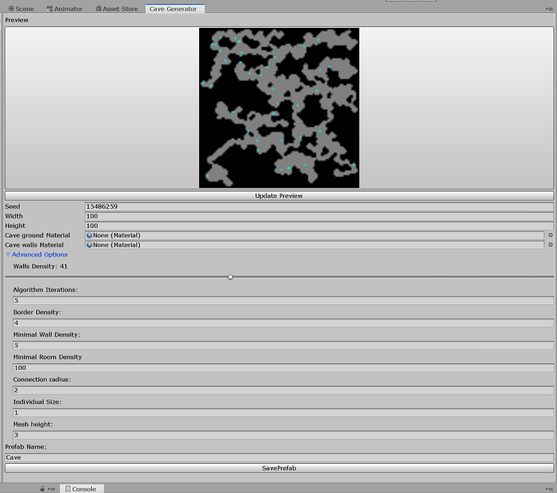
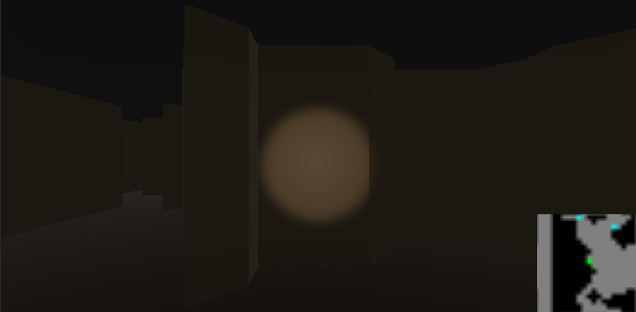

# ProceduralCaveGenTool
Unity Tool to create procedural Caves with 3D Meshes

# Repository Overview
---
This repository contains files of an Unity Project that contains a tool to generates random 3D Cave Prefabs and save them in the
project directory. This Caves can be customized with different properties.

The project also contains a test scene, with a First Person Character inside a Cave Generated with the tool. The scene also tracks
the Player position inside the cave and displays it in a minimap located at the bottom right corner of the Screen.

# Cave Generator Tool
---
### Description
The Cave Generation tool as his name said generates Cave Prefabs using the Cellular Automata algorithm and saves them in the Project
directory.

You can customize different kind of properties for the Cave before being generated like width and height among others, that will be
described below.

### How to Use

Inside the Unity Editor:

1. In the menu bar access: Tools -> Cave Generator
2. The next window should be displayed:

3. Customize the different properties you wish, but be careful with the advanced properties, they are delicate and can result
with odd results.
4. (Optional) You can press the _Show Preview_ buttom to see a preview of the cave you're about to generate in the window.
5. Press the _Save Prefab_ buttom and that's it, your Cave prefab will be created.

#### Properties Description

| Property | Description |
| ------ | ----------- |
| Seed   | Used to randomize the values that the used to create the cave, best to use big prime numbers. |
| Width | Horizontal size of the cave. |
| Height    | Vertical Size of the cave. |
| Ground Material   | Material that will be applied to the ground mesh. |
| Walls Material | Material that will be applied to the walls mesh. |
| Wall Density | Density of walls generated in the cave. Lower values generate bigger and wider caves, while bigger values generate smaller and thigter caves. This value oscillates between 0 and 100 |
| Algorithm Iterations | Number of times the cellular authomata algorithm will be applied, more iterations generates. |
| Border Density | The amount of wall layers applied from the borders of the cave. |
| Minimal Wall Regions Density | Minimal area of a wall region. If the algorithm creates a wall region smaller than this, it's replaced with a free space. |
| Minimal Room Regions Density | Minimal area of a room region.  |
| Passages Density | The density of a room region that connects two room regions. |
| Scale | Scale on units of the map. |
| Walls Height | Height of the walls. |
| Prefab Name | Name of the prefab when saved. |

### How it works

+ First a matrix of integers it's generated applying a variation of the cellular automata algorithm and some aditional rules to shape
the cave to our convenience.
+ Then we create a grid of square cells and we apply the marching squares algorithm to generate the vertices and triangles of the 
+ Then we find the edges looking for the shared triangles properties to shape the edge mesh.
+ Once we have the shape we create three game some game objects.
+ A Gameobject with an script that saves the data of the cave and can be used to obtain some values relevant to the cave.
We will call it the main container of the cave.
+ A game object that contains the mesh filter of the cave shape.
+ A game object that contains the mesh filter of the cave walls, and collider of the mesh.
+ A plane to serve as the ground of the cave.
+ We set this game objects as sons of the main container and we proced to save the prefab.
+ We delete the created game object from the scene.

# Test Scene
---
### Description
The test scene contains a First Person Player inside a Cave generated with the tool, you can move around the cave and you have access
to a minimap in the screen that tracks your position inside the cave in a given radius. You can find inside the cave some collectable items, unfortunately they are just around there you cannot interact with them.

### How it works

+ A basic Player controller and camera movement script.
+ A Cave script that contains the data of all the cave cells with their respective position;
+ A script that given a position, tracks the cave states in a radius.
+ A Script that renders pixels on a UI Raw Image that serves as the minimap
+ A game controller script that it's checking the player position every determined time and ask for the cave status around that position,
then calls the UI script to render that position.

### Minimap

The minimap is displayed on the bottom right corner of the screen like this

As you can see the green dot represents the player and the blue dots are collectables, the minimap is updated in real time, unfortunately it cannot rotate so the view is static.

# Final Thoughts

I spend all 20 hours on this but they are a lot of things I wanted to add, and I probably will after this test so here is the list:
+ The optional NPC inside the map, I would love to work with some pathfinding algorithms to make the NPC moving.
+ Add some validation and asethics to the Editor Window.
+ Improve the Cave generation algorithm adding more states and improving the collectable generation rule, because it was implemented the last hours.
+ Improve the connection algorithm, what i wanted to add was an algorithm that connects closer very close edges of the same region to form more than one connection for room and more looped cave points, I made a few test in the last hours but I couldn't finish it.
+ Made more interactions in the test scene, like you can interact with the collectables and add some dinamics like puzzles.

